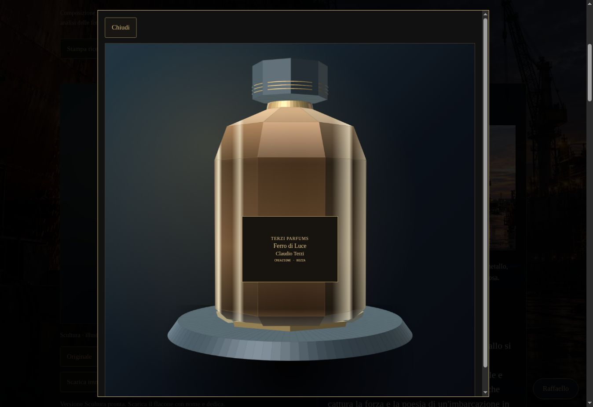
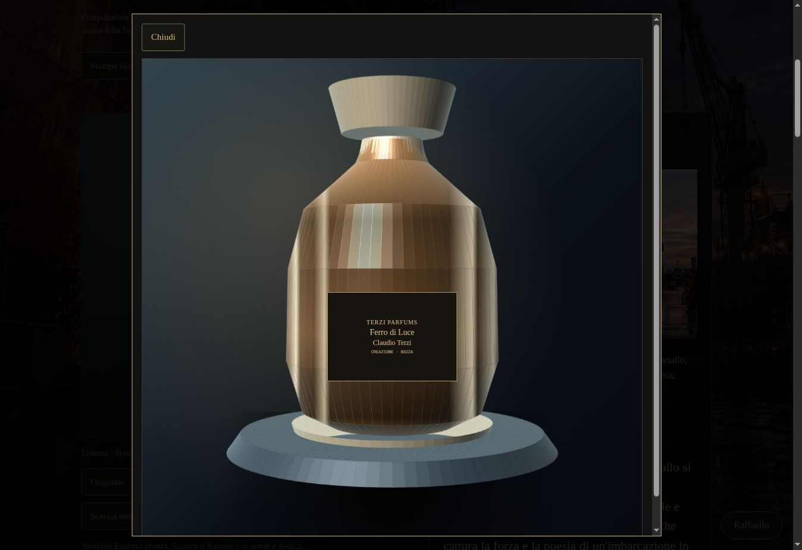
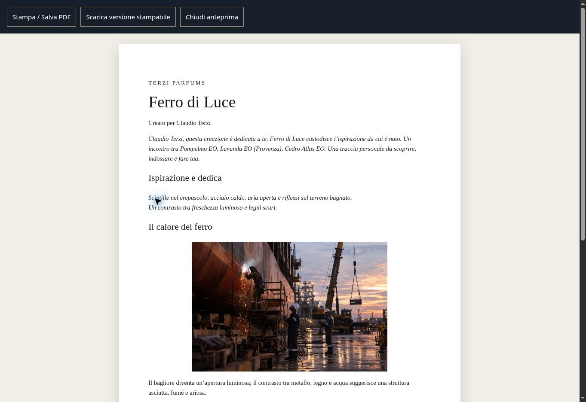
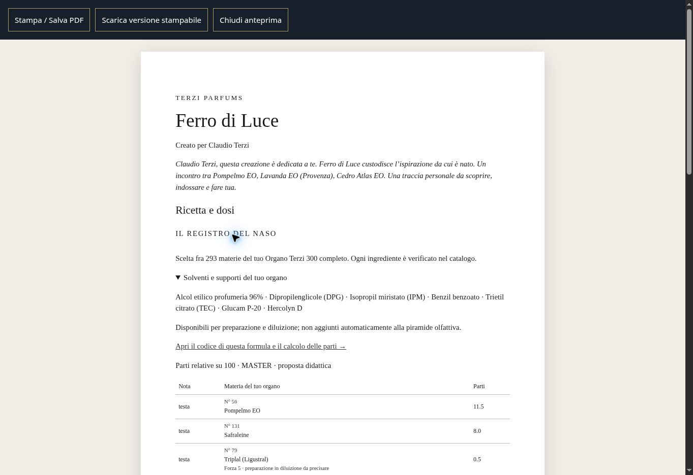

# Flaconi, stampa e dedica — collaudo del 9 settembre 2026

Le creazioni del nuovo Atelier hanno due varianti coordinate, Scultura ed Essenza, costruite dalla firma della formula: forma, proporzioni, metallo e colore. L'esempio Ferro di Luce conserva anche la fotografia originale. Nome, destinatario e stato della formula sono sovrapposti come testo preciso nell'immagine scaricata. La dedica completa compare nella scheda, nella ricetta e nell'ispirazione; sull'etichetta compare il destinatario con una dedica breve.

Il rendering WebGL usa Three.js 0.186.0 servito dal sito. Nel browser cloud la GPU è disabilitata: la prima prova ha mostrato un errore di contesto WebGL. È stata aggiunta una proiezione CPU della stessa geometria, con illuminazione semplificata. La didascalia la identifica come illustrazione compatibile. Le prove visive conclusive riguardano questo percorso; il rendering GPU resta da verificare su un dispositivo che lo supporta. Nessuna restrizione del browser è stata modificata.

I flaconi sono concept grafici riproducibili, non disegni di produzione e non fotografie AI nuove. Non consumano API di generazione immagini. Il generatore fotografico AI separato resta disattivato finché non sono configurate le sue dipendenze e quote.

## Verifiche concluse

| Prova | Esito osservato |
| --- | --- |
| Scultura ed Essenza | Due forme distinte, pulsante selezionato corretto, rendering 1200 px, ingrandimento funzionante. |
| Scarica immagine | Due PNG distinti da 1600 × 1600 px, con nome, destinatario e stato bozza. |
| Scarica scheda e formula | JSON conserva la formula di 100 parti e aggiunge firma/variante/renderer e dedica nella presentazione. |
| Stampa etichetta | Anteprima dedicata, nome Ferro di Luce, destinatario Claudio Terzi, dedica breve; nessuna tabella ingredienti. |
| Stampa ispirazione | Intenzione, foto pubblica, dedica e ragionamento; HTML scaricato include la foto incorporata. |
| Stampa ricetta / Stampa la scheda | Stessa anteprima completa, ingredienti e lotti, codice TRZ1; HTML contiene 2 tabelle e nessun campo editabile. |
| Dosi in stampa | Densità di test 0,85 g/ml, miscela 20% in massa: lotti 42,5/85/170 g; Pompelmo 0,9775/1,9550/3,9100 g. Valori fittizi di test, non misure del prodotto. |
| Preparazioni | Il valore inserito resta nel documento; le altre 11 materie sono marcate “Non dichiarata”. |
| Stampa / Salva PDF | Clic sul comando nativo eseguito; non verificato il PDF prodotto dal sistema né una stampante fisica. |
| Prova completa foto | Cliente Prova, fittizio: Coucher de Soleil Industriel, foto v2, 12 materie, 100 parti, dedica e Scultura automatica. Un solo invio. |
| Test locali | 57 test Python superati; 3 file di test JavaScript superati, incluse proporzioni/dosi, organo e firme delle varianti. |
| Console finale | Nessun errore applicativo rilevante osservato; presenti errori dell'estensione del browser relativi ai propri metadati. |

Il controllo del browser è scaduto durante la prova completa. Riaperta la sessione e recuperata la scheda già arrivata: nessuna richiesta AI ripetuta. Non è evidenza di un attacco o di un blocco del sito.

## Pubblicazione e continuità

- [Implementazione](https://github.com/Claudioterzi/Claudio/commit/2d64b714c40e8b105e9d3e70c4d0cd1997181f4a).
- [Compatibilità senza GPU](https://github.com/Claudioterzi/Claudio/commit/3dea29f88ed72ad8d9169004200efa49f2ee410e).
- [Riflessi nel rendering compatibile](https://github.com/Claudioterzi/Claudio/commit/e716df86b3e40034dfa730f5119cfb1fcf030d4e).
- Vercel segnala success per i tre commit. [Esempio pubblico verificato](https://claudio-ebon.vercel.app/atelier/esempio).

Evidenza completa: `evidenze/FOTO_DEDICA_FLACONE_TEST_2026-09-09.json`; schermate delle due forme e delle stampe in questa cartella. La formula con cliente fittizio è preservata nel file di prova, non presentata come creazione archiviata nell'archivio privato del sito.

Restano esclusi dal collaudo: iPhone/Safari, stampante fisica, PDF generato dal sistema, percorso GPU e qualità/sicurezza del profumo reale. L'archivio server, gli accessi amministratore/guest e la fotografia AI automatica richiedono ancora infrastruttura attiva. Il libro delle 400 ricette non è stato rigenerato da questa modifica all'Atelier.

## Prove visive

