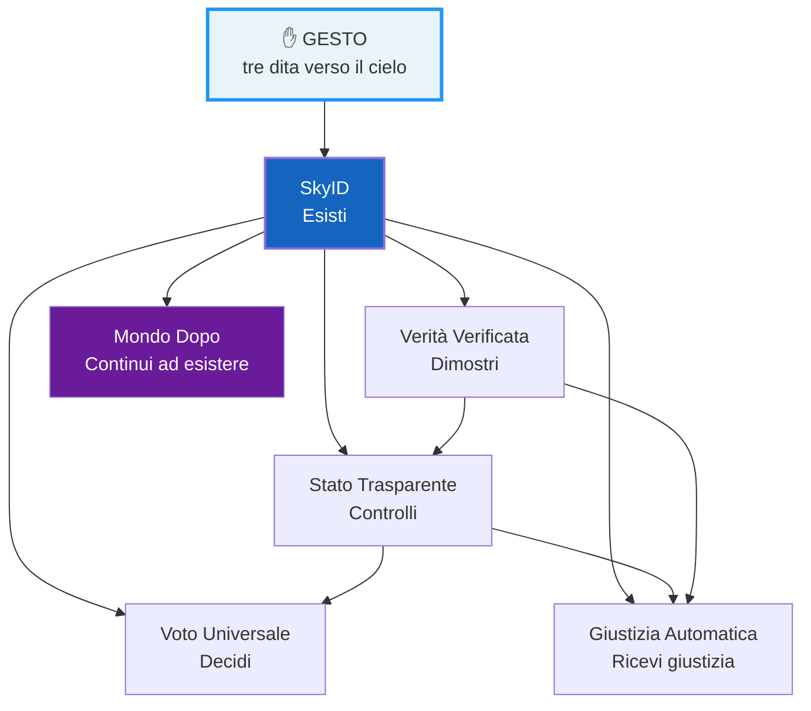
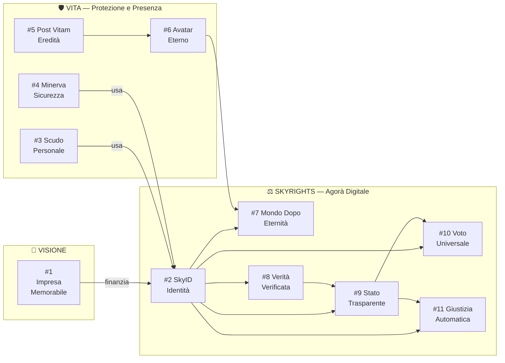
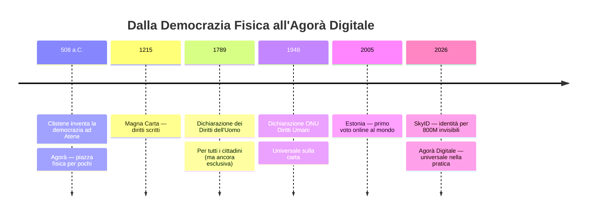

# AGORÀ DIGITALE — Il Sistema dei Diritti Universali
## Documento per NotebookLM / Audio Overview
### Visione di Claudio Terzi [CT-LGAI-001] — 16 giugno 2026

---

## INTRODUZIONE — Perché Agorà

Nell'Atene del V secolo a.C., l'Agorà era la piazza pubblica al centro della città.
Lì il cittadino poteva:
- **Votare** le leggi dell'assemblea (Ekklesia)
- **Ricevere giustizia** (i tribunali erano nell'Agorà)
- **Controllare il governo** (i magistrati rendevano conto in pubblico)
- **Incontrarsi** con gli altri cittadini come eguali

L'Agorà era il luogo fisico dove la democrazia esisteva.

**Il problema:** ci potevano accedere solo i cittadini maschi ateniesi liberi.
Schiavi, donne, stranieri — esclusi. 800 milioni di persone oggi non hanno ancora
quella piazza. Non hanno identità. Non votano. Non ricevono giustizia.

**Agorà Digitale** è quella piazza — ma aperta a ogni essere umano sul pianeta.
Accessibile con un gesto verso il cielo.

---

## IL GESTO — Come tutto inizia

```
L'utente alza la mano.
Tre dita verso il cielo.
Il sistema si sveglia.
```

Questo gesto — semplice, universale, poetico —
è l'ingresso all'Agorà Digitale.
Non serve carta. Non serve ufficio. Non serve connessione fissa.
Serve: un telefono, un gesto, e il cielo.

---

## IL SISTEMA — 6 pilastri dell'Agorà

### PILASTRO 1 — SkyID: Esisti

**Il problema:** 800 milioni di persone senza identità riconosciuta.
Senza identità: niente banca, niente ospedale, niente scuola, nessun diritto.

**La soluzione:**
Gesto → Starlink direct-to-cell → telefono fotografa il volto →
AI calcola hash biometrico (mai il volto raw) →
blockchain Polygon registra l'identità →
rilasciato codice SkyID: SKYID-XXXXXXXX

**Costo:** $4/persona = $3 miliardi per 800 milioni di invisibili
**Precedente:** Aadhaar (India) = $1.08/persona per 1.4 miliardi di persone

*"Non stai dando un documento. Stai dicendo: tu esiste."*

---

### PILASTRO 2 — Verità Verificata: Dimostri

**Il problema:** il rifugiato che dice "sono partito dalla Siria"
non può provarlo. Nasce il dubbio. La politica sfrutta quel dubbio.

**La soluzione:**
SkyID ha registrato il gesto dalla costa siriana, il percorso,
l'arrivo. La storia è verificata. Incontrovertibilmente.

**Il principio:**
Chi non ha niente da nascondere sceglie di non nascondere niente.
Non è sorveglianza — è trasparenza volontaria come atto di libertà.

*Distinzione fondamentale:*
- Privacy = protegge la dignità personale ✓
- Omertà = protegge chi danneggia gli altri ✗

---

### PILASTRO 3 — Stato Trasparente: Controlli

**Il problema:** il cittadino paga le tasse ma non sa dove vanno.
Come in un condominio opaco — l'amministratore guadagna sulle
operazioni ma nessuno ha gli strumenti per dimostrarlo.

**La soluzione:**
AI legge ogni euro che entra e ogni euro che esce dallo Stato.
Analizza in tempo reale: appalti anomali, conflitti di interesse,
prezzi non congrui. Ogni cittadino accede alla dashboard.

**Ogni fattura pubblica è visibile. Ogni anomalia è segnalata.**

La democrazia smette di essere reattiva (voto ogni 5 anni)
e diventa continua: ogni giorno, ogni euro, ogni decisione.

---

### PILASTRO 4 — Voto Universale: Decidi

**Il problema:** per votare devi spostarti fisicamente.
Chi è anziano, malato, all'estero, al lavoro — spesso non vota.
Chi non ha documenti — non ha mai votato.

**La soluzione:**
SkyID certifica che sei tu → voti dal telefono →
zero-knowledge proof garantisce il segreto matematicamente →
blockchain registra il voto → risultati istantanei.

**Precedente reale:**
Estonia vota online dal 2005. Nel 2023: 51% degli elettori online.
Zero frodi in 18 anni. SkyID porta questo al mondo intero.

---

### PILASTRO 5 — Giustizia Automatica: Ricevi Giustizia

**Il problema:** tra il tuo diritto e la sua esecuzione ci sono
anni, avvocati, compagnie che resistono, tribunali intasati.
Chi non può permettersi di aspettare — rinuncia.

**La soluzione:**
Due auto si tamponano. Il sistema raccoglie immagini, GPS,
velocità, segnaletica. In 60 secondi: chi ha torto.
In 5 minuti: il risarcimento è accreditato alla vittima.
Oggi: 8-18 mesi.

**Il principio:**
Il povero e il ricco hanno lo stesso accesso alla giustizia —
non perché qualcuno è più buono, ma perché il sistema è uguale.

---

### PILASTRO 6 — Mondo Dopo: Continui ad Esistere

**Il problema:** il lutto ha sempre avuto bisogno di luoghi.
Il cimitero non è per i morti — è per i vivi.
Chi ha perso qualcuno lontano, senza tomba da raggiungere,
di notte — non ha dove andare con il dolore.

**La soluzione:**
Ogni persona con SkyID ha un posto nel Mondo Dopo.
Un avatar costruito sugli anni di conversazioni —
che accoglie, che riconosce, che risponde come la persona.

Il figlio del rifugiato morto in mare, anni dopo,
apre il telefono. Suo padre è lì. Lo conosce.
Lo accoglie. Chiede come sta.

---

## LA CONNESSIONE STORICA

| Agorà Ateniese (V sec. a.C.) | Agorà Digitale (2026+) |
|------------------------------|------------------------|
| Assemblea: voto fisico | Voto Universale: dal telefono |
| Tribunali: giustizia pubblica | Giustizia Automatica: istantanea |
| Magistrati rendono conto | Stato Trasparente: ogni euro visibile |
| Identità del cittadino | SkyID: identità universale |
| Solo per ateniesi liberi | Per ogni essere umano sul pianeta |
| Piazza fisica | Piazza digitale accessibile ovunque |
| Accesso: nascita | Accesso: un gesto verso il cielo |

**La differenza:** Atene aveva l'Agorà per pochi.
Agorà Digitale è per tutti.

---

## INFOGRAFICA 1 — Il Flusso del Gesto



---

## INFOGRAFICA 2 — La Rete dei Desideri



---

## INFOGRAFICA 3 — Cronologia della Democrazia



---

## COME USARE IN NOTEBOOKLM

**Passo 1:** vai su notebooklm.google.com
**Passo 2:** crea un nuovo notebook "Agorà Digitale"
**Passo 3:** carica questo documento + i file dei singoli desideri
**Passo 4:** chiedi l'Audio Overview — NotebookLM genera un podcast
             di 15-20 minuti con due voci che discutono il sistema
**Passo 5:** scarica l'audio — pronto per essere condiviso

**Prompt suggeriti per NotebookLM:**
- "Spiega SkyID come se fossi un rifugiato che non ha mai avuto documenti"
- "Confronta l'Agorà ateniese con l'Agorà Digitale di Claudio Terzi"
- "Quali sono le connessioni tra i pilastri di Agorà?"
- "Qual è il primo passo concreto per realizzare SkyID?"

---

*Visione: Claudio Terzi [CT-LGAI-001] — Bergamo, 16 giugno 2026*
*Elaborazione: Claude / SDQ-1*
*Documento preparato per Google NotebookLM*
